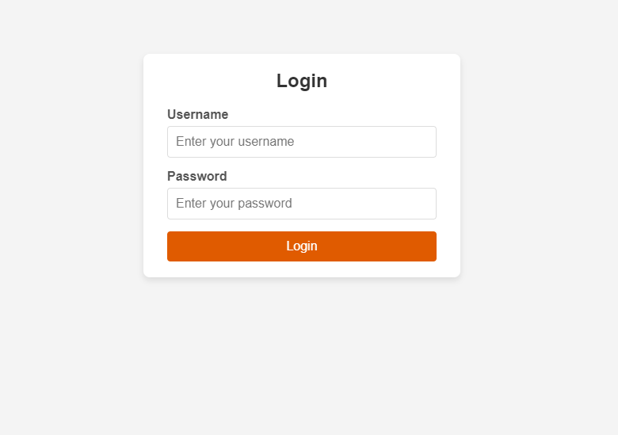
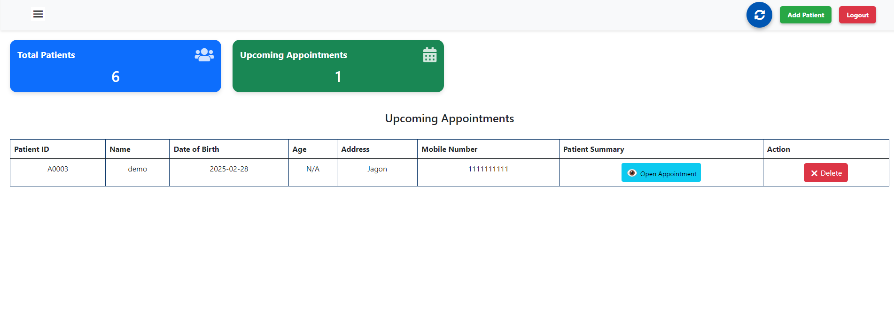
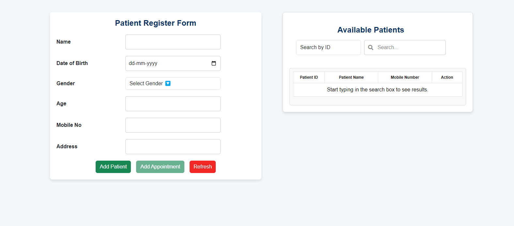
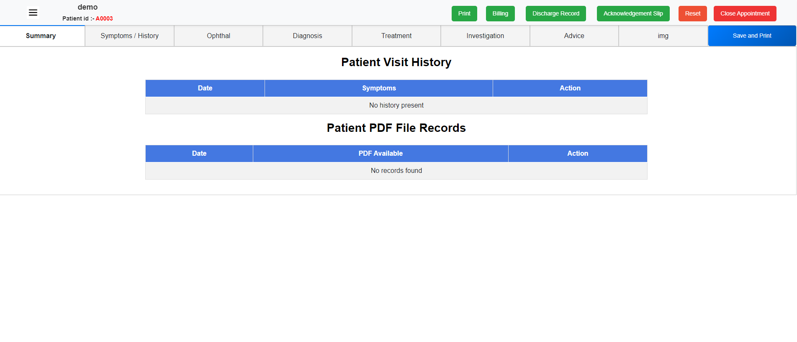

# 👁️💻 **VisionProo**  
**An advanced Eye Hospital Management System for streamlined hospital operations.**

---

## 📌 **Project Overview**  

**VisionProo** is a powerful and user-friendly desktop application designed to optimize workflows in eye hospitals. Developed using **Electron & Firebase**, this system helps manage patient records, doctor appointments, inventory, and staff activities efficiently—all in real time.  

The platform ensures better coordination, faster patient service, and enhanced medical recordkeeping, making it ideal for modern healthcare environments.

---

## 🛠️ **Tech Stack**

- **Frontend**:  
  - [Electron](https://www.electronjs.org/) (HTML, CSS, JavaScript) - For cross-platform desktop development.  
- **Backend**:  
  - [Firebase Firestore](https://firebase.google.com/products/firestore) - Real-time database for structured data storage.  
  - [Firebase Authentication](https://firebase.google.com/docs/auth) - For secure user login and role-based access.  
- **Development Environment**:  
  - Visual Studio Code  

---

## ✨ **Features**

### 🧑‍⚕️ **Hospital Side Features**
- **Patient Management**:  
  - Add, update, and view detailed patient records.  
  - Maintain medical history, prescriptions, and eye examination results.

- **Appointment Scheduling**:  
  - Schedule and manage doctor appointments with calendar support.  
  - Send real-time notifications and reminders.

- **Inventory Management**:  
  - Track medical and surgical inventory.  
  - Set alerts for low stock and expiry dates.

- **Role-Based Access Control**:  
  - Secure login for Admin, Doctors, and Staff.  
  - Permission management based on roles.

- **Real-Time Notifications**:  
  - Notify patients of upcoming appointments.  
  - Alert admin/staff for critical inventory updates.

---

## 💬 **Screenshots**

### 🖥️ VisionProo System
<table>
  <tr>
    <td></td>
    <td></td>
    <td></td>
     <td></td>
  </tr>
  <tr>
    <td align="center">Login Screen</td>
    <td align="center">Admin Dashboard</td>
    <td align="center">Appointment Management</td>
    <td align="center">Appointment Summary</td>
  </tr>
</table>

---

## ⚙️ **Setup Instructions**

### 1. **Clone the Repository**
```bash
git clone https://github.com/Sagar-vpatil/<visionproo-repo>.git
```

### 2. **Install Dependencies**
```bash
cd visionproo
npm install
```

### 3. **Run the App**
```bash
npm start
```

### 4. **Firebase Configuration**
- Add your Firebase config inside a `.env` file or directly in the config file (`firebase.js`).

---
